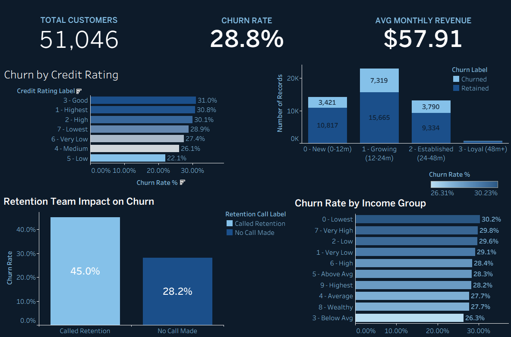

# Churn Intelligence Platform: End-to-End Data Analysis



## 📌 Project Overview
This project is a comprehensive **End-to-End Data Analysis** platform designed to identify, analyze, and mitigate customer churn for a major telecommunications provider. Using a dataset of **51,000+ subscribers**, the platform provides actionable insights into churn drivers through a high-performance **SQL ETL pipeline** and an executive **Tableau Dashboard**.

## 🚀 Key Features
*   **SQL-Powered ETL**: 100% SQL-based data cleaning and transformation using **DuckDB**.
*   **Advanced Analytics Engineering**: Automated calculation of critical KPIs like `DropRate`, `RevenuePerMinute`, and `OverageRatio`.
*   **Executive Dashboard**: An interactive Tableau suite for tracking Revenue at Risk and Segmented Churn.
*   **Statistical Profiling**: Python-based statistical analysis identifying correlations between usage patterns and churn.

## 🛠️ Technical Stack
*   **Database Engine**: DuckDB (SQL)
*   **Data Processing**: Python (Pandas, Pathlib)
*   **Visualization**: Tableau Desktop, Seaborn, Matplotlib
*   **Documentation**: Markdown, PDF Technical Manual

## 📊 Dashboard Insights
Based on the **28.8% Churn Rate** identified in the dashboard:
1.  **Credit Rating Sensitivity**: Customers with "Good" to "Highest" credit ratings show the highest churn propensity (approx. 31%).
2.  **Tenure Risk**: The "Growing" (12-24m) segment represents the largest volume of churners.
3.  **Retention Impact**: Customers who interacted with the Retention Team showed a **45% churn rate**, suggesting the need for more effective "Save Offers."

## 📂 Project Structure
```text
churn_project/
├── sql/
│   └── etl_pipeline.sql      # Master SQL Transformation Logic
├── src/
│   ├── sql_engine.py         # DuckDB SQL Runner
│   └── eda_analyst.py        # Statistical Analysis Script
├── data/
│   ├── raw/                  # Source CSV
│   └── processed/            # Tableau-Ready CSV
├── report/
│   ├── Full_Technical_Manual.pdf  # Detailed Technical Guide
│   └── dashboard_preview.png      # Dashboard Screenshot
└── main_analyst.py           # Project Orchestrator
```

## ⚙️ How to Run
1.  **Install Dependencies**: `pip install -r churn_project/requirements.txt`
2.  **Execute Pipeline**: `python churn_project/main_analyst.py`
3.  **Update Tableau**: Open `.twb` and click **Refresh**.

---
**Author**: [Your Name/GitHub Profile]  
**Goal**: Demonstrating the transition from raw data to business intelligence through SQL and Data Storytelling.
